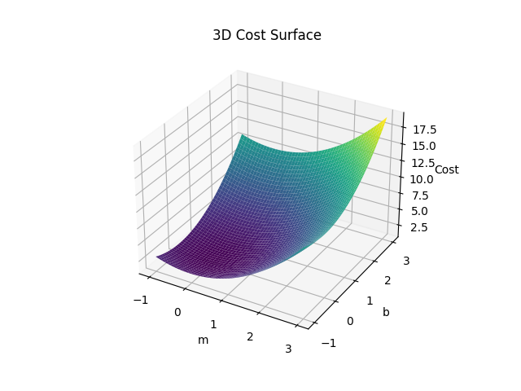
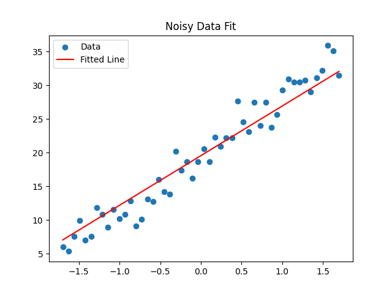

# Gradient Descent from Scratch

## Overview

This project implements Gradient Descent from scratch for linear regression without using machine learning libraries. It demonstrates how optimization works by minimizing the cost function using iterative updates.

The project also includes visualization techniques to understand convergence behavior and compares different variants of Gradient Descent.

---

## Features

* Implementation of Linear Regression using Gradient Descent from scratch
* Cost function computation and minimization
* Learning rate comparison and its effect on convergence
* Implementation of:

  * Batch Gradient Descent
  * Stochastic Gradient Descent (SGD)
  * Mini-batch Gradient Descent
* Visualization of cost vs iterations
* 3D cost surface visualization
* Animation of model convergence
* Training on both clean and noisy datasets

---

## Project Structure

```
gradient-descent-project/
│
├── data/
│   └── dataset.csv
│
├── data.py
├── model.py
├── basic_gd.py
├── learning_rate.py
├── sgd_mini_batch.py
├── cost_surface_3d.py
├── animation.py
├── noise.py
├── README.md
```

---

## Installation

Clone the repository:

```
git clone https://github.com/your-username/gradient-descent-from-scratch.git
cd gradient-descent-from-scratch
```

Install dependencies:

```
pip install numpy pandas matplotlib
```

---

## Usage

Run basic gradient descent:

```
python basic_gd.py
```

Compare learning rates:

```
python learning_rate.py
```

Run SGD and Mini-batch:

```
python sgd_mini_batch.py
```

Visualize 3D cost surface:

```
python cost_surface_3d.py
```

Run animation:

```
python animation.py
```

---

## Results

* Cost decreases over iterations showing convergence
* Learning rate affects speed and stability
* SGD shows noisy convergence
* Mini-batch provides balanced performance
* Visualization helps in understanding optimization behavior

### Cost vs Iterations


### 3D Cost Surface


### Noisy Data Fit


---

## Concepts Covered

* Linear Regression
* Cost Function (Mean Squared Error)
* Gradient Descent Optimization
* Learning Rate
* Convergence
*  SGD vs Mini-batch
* Data Normalization

---

## Future Improvements

* Add regularization (L1/L2)
* Extend to multi-variable regression
* Implement logistic regression
* Add interactive visualization

---

## Author

Ankit Kumar
B.Tech Mathematics and Computing
NIT Jalandhar

GitHub: https://github.com/ankit6395
LinkedIn: https://www.linkedin.com/in/ankit6395
